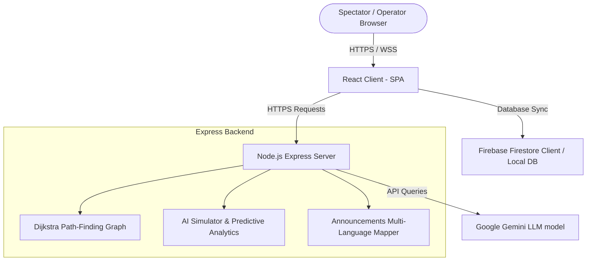

# ArenaMind AI - Enterprise Smart Stadium Platform

> **"Making Stadiums Intelligent with Generative AI"**

ArenaMind AI is an enterprise-grade, production-ready full-stack operations platform. It integrates visual crowd intelligence, indoor routing engines, multi-lingual audio assistant services, parking models, restroom cleaner schedules, and emergency response frameworks to streamline tournament management.

---

## 1. System Architecture



---

## 2. Folder Structure

```
arena-mind-ai/
├── client/                      # Frontend SPA
│   ├── src/
│   │   ├── components/
│   │   │   ├── Layout.tsx       # Master grid, notifications drawer, role selectors
│   │   │   ├── StadiumMap.tsx   # Interactive Leaflet map, custom icons, path overlays
│   │   │   ├── VoiceAssistant.tsx # Speech-to-Text / Text-to-Speech LLM interface
│   │   │   ├── QRScanner.tsx    # Viewfinder emulator with laser line, ticket decoders
│   │   │   └── ThemeToggle.tsx  # Local preference theme switcher
│   │   ├── context/
│   │   │   └── AuthContext.tsx  # Authentication provider & profile state hooks
│   │   ├── firebase/
│   │   │   └── config.ts        # Database configurations & local emulator fallbacks
│   │   ├── pages/
│   │   │   ├── LandingPage.tsx  # Feature dashboards, counters, rotators
│   │   │   ├── Dashboard.tsx    # Live metric grids, AI recommendation banners
│   │   │   ├── Login.tsx        # Card logins with role-quickfills
│   │   │   ├── Signup.tsx       # User creation with role assignments
│   │   │   ├── ResetPassword.tsx # Email reset dispatch controllers
│   │   │   └── roles/
│   │   │       ├── SpectatorDashboard.tsx  # Seat finder, local concessions lists
│   │   │       ├── OrganizerDashboard.tsx  # Evacuations, translations triggers
│   │   │       ├── VolunteerDashboard.tsx  # Gate assignments, helpers tickets
│   │   │       ├── SecurityDashboard.tsx   # Incident reporting, Recharts crowd lines
│   │   │       ├── MedicalDashboard.tsx    # Casualty tracking, medics dispatch lines
│   │   │       └── AdminDashboard.tsx      # System simulators, AI execution logs
│   │   ├── services/
│   │   │   └── api.ts           # HTTP requests with offline fallbacks
│   │   ├── tests/
│   │   │   └── stadium.test.ts  # Vitest unit suites
│   │   ├── index.css            # Tailwind bases, Leaflet custom theme overwrites
│   │   ├── App.css              # Style reset overrides
│   │   ├── App.tsx              # Router structures
│   │   └── main.tsx             # DOM mount bootstrap
│   ├── package.json
│   ├── tsconfig.json
│   └── tailwind.config.js
│
└── server/                      # Backend Service
    ├── server.js                # Express loader & middlewares
    ├── router.js                # HTTP routes (chat, routing, predict, translate)
    └── package.json
```

---

## 3. API Documentation (REST endpoints)

All endpoints accept and return JSON payloads.

### `POST /api/chat`
Conversational smart assistant interface connecting to Google Gemini.
* **Payload**:
  ```json
  {
    "message": "Take me to Seat A-120",
    "language": "english",
    "userRole": "spectator"
  }
  ```
* **Response**:
  ```json
  {
    "response": "To reach Seat A-120, proceed to Tier 1, Section A, and walk down to Row 12. Estimated walking time is 3 minutes.",
    "provider": "gemini"
  }
  ```

### `POST /api/routing`
Finds the shortest path on the stadium coordinate nodes using Dijkstra's algorithm.
* **Payload**:
  ```json
  {
    "startNode": "gate-a",
    "endNode": "seat-a120",
    "routingType": "fastest" // 'fastest' | 'least_crowded' | 'wheelchair'
  }
  ```
* **Response**:
  ```json
  {
    "path": ["Gate A (North)", "Lower Tier 1 Concourse", "Seat A-120 (Tier 1)"],
    "coordinates": [[12.9780, 77.5910], [12.9778, 77.5912], [12.9776, 77.5914]],
    "directions": ["Scan ticket...", "Walk straight...", "Seat is ahead..."],
    "estimatedTimeMin": 2,
    "wheelchair": true
  }
  ```

### `POST /api/predict`
Calculates wait times at ticket booths and generates timeline forecasts.
* **Payload**:
  ```json
  {
    "weatherCondition": "Clear",
    "currentMatchSpectators": 68000
  }
  ```
* **Response**:
  ```json
  {
    "hourlyOccupancy": [{"hour": "18:00", "occupancy": 62560, "risk": 65, "waitTimeGateB": 22}],
    "recommendation": "Gate B is reaching 92% capacity. Redirect spectators entering from Parking Zone 2 towards Gate D.",
    "peakHour": "18:00",
    "riskLevel": "High",
    "resourceDemand": {"volunteers": 120, "security": 180, "medicalTeams": 12}
  }
  ```

### `POST /api/translate`
Translates updates into Telugu, Hindi, Tamil, and Kannada.
* **Payload**:
  ```json
  {
    "text": "Gate A Closed"
  }
  ```
* **Response**:
  ```json
  {
    "translations": {
      "english": "Gate A is closed due to high crowd density. Please proceed to Gate B or Gate D.",
      "telugu": "ఎక్కువ రద్దీ కారణంగా గేట్ A మూసివేయబడింది. దయచేసి గేట్ B లేదా గేట్ D కి వెళ్ళండి.",
      "hindi": "अत्यधिक भीड़ के कारण गेट A बंद है। कृपया गेट B या गेट D की ओर बढ़ें.",
      "tamil": "அதிக கூட்ட நெரிசல் காரணமாக கேட் A மூடப்பட்டுள்ளது. தயவுசெய்து கேட் B அல்லது கேட் D க்கு செல்லவும்.",
      "kannada": "ಹೆಚ್ಚಿನ ಜನದಟ್ಟಣೆಯ ಕಾರಣ ಗೇಟ್ A ಅನ್ನು ಮುಚ್ಚಲಾಗಿದೆ. ದಯವಿಟ್ಟು ಗೇಟ್ B ಅಥವಾ ಗೇಟ್ D ಗೆ ತೆರಳಿ."
    },
    "provider": "gemini"
  }
  ```

---

## 4. User Manual

### Spectators
1. **Quick Login**: On the home page, select **Spectator**.
2. **Find Your Seat**: Type `A-120` in the top search field. Click **Find Seat** to overlay your walking route on the stadium map.
3. **Scan Ticket**: Use the QR Scanner panel to scan a ticket. This automatically decodes holder details, identifies the closest parking zones/facilities, and plots coordinates from your entry gate to your seat.
4. **Chat**: Select your preferred language (Hindi, Telugu, Tamil, Kannada, English) and type in the chatbot box or click **Speak Now** to use the Voice AI assistant.

### Organizers
1. **Operations Status**: Monitor wait times and active incidents on the main dashboard cards.
2. **Translate Broadcast**: Enter messages inside the AI Announcement Generator to instantly translate them into five regional languages.
3. **Evacuation Controls**: In an emergency, select **Trigger Evacuation**. This puts the stadium in red Evacuation Mode, updates security logs, opens all exit gates, and plots exit routing paths.

### Volunteers
1. **Assignment Board**: Review gate queues. Select **Assign Myself Here** on congested gates to deploy help, which dynamically reduces gate queue times in the simulation.
2. **Duty Guide**: Review general coordination guidelines on the dashboard.

### Security Officers
1. **Flow Logs**: Observe crowd entry rates and risk indexes on the Recharts Area Chart.
2. **Incident logs**: Log new incidents using the reporter form (specify location, severity, description).
3. **Clear Incidents**: Mark active alerts as resolved to clear them from screen feeds.

### Medical Staff
1. **Alert Tracker**: View incoming medical emergency dispatch cards.
2. **Route Calculation**: Click **Dispatch Route** on any incident card to compute a path from Medical Station Alpha to the patient's seat coordinates on the map.
3. **Incident Clearing**: Clear solved incidents to return staff status to standby.

### Administrators
1. **Weather controls**: Simulate clear, rainy, or hot settings to trigger different predictive recommendations.
2. **Crowd controls**: Add or reduce spectator numbers to adjust flow parameters.
3. **Audit trails**: Read API logs showing prompt text, executing provider (Gemini or Mock Local), and timestamps.

---

## 5. Deployment Guide (Vercel & Node)

### Local Deployment

1. **Clone project** and enter workspace.
2. **Configure environment variables**:
   Create a `.env` file in the `server/` directory:
   ```env
   PORT=5000
   GEMINI_API_KEY=your_google_gemini_api_key_here
   ```
3. **Launch Express Backend Server**:
   ```bash
   cd server
   npm install
   npm start
   ```
4. **Launch Client Web Server**:
   ```bash
   cd client
   npm install
   npm run dev
   ```
   Open `http://localhost:5173` in your browser.

### Vercel Serverless Deployment
1. Install Vercel CLI: `npm i -g vercel`
2. Run deployment: `vercel` inside project root.
3. Configure `GEMINI_API_KEY` under project settings in your Vercel Dashboard.

---

## 6. Engineering Enhancements & Compliance

### Code Quality & Fast Refresh
- **Provider & Context Separation**: Context objects (`ToastContext.ts`) are decoupled from their Provider component modules (`ToastProvider.tsx`), eliminating Fast Refresh compiler warnings.
- **Hook Isolation**: Custom hooks (e.g. `useToast.ts`, `useAuth.ts`, `useVoiceSpeech.ts`) are located in `src/hooks/` for reusability.

### WCAG 2.2 AA Accessibility Parameters
- **Anchor Skip Links**: Accessible keyboard navigation includes a skip link routing keyboard focus straight to main page regions.
- **Landmark Segregations**: Expressive landmarks (`role="application"`, `role="region"`, `role="list"`, `role="listitem"`) guide screen readers.
- **Descriptive Legends**: Colored visual status indicators and line coordinates contain `sr-only` translations.

### Enterprise Security Design
- **Content Security Policies**: Helmet protects routes from insecure script injection while authorizing Firebase Firestore sockets, Google Fonts, and Carto maps.
- **Role-Based Access Controls (RBAC)**: Firestore configuration (`useRealtimeCollection`) dynamically parses authenticated tokens, preventing spectators from executing unauthorized updates on matches, gates, or parking zones.

### High-Coverage Test Suites
- Verifies authentication operations, wayfinding shortest paths, WCAG compliance, toast rendering lists, loading states, and error handling.
- Run `npm test -- --run` to execute all 46+ tests.

