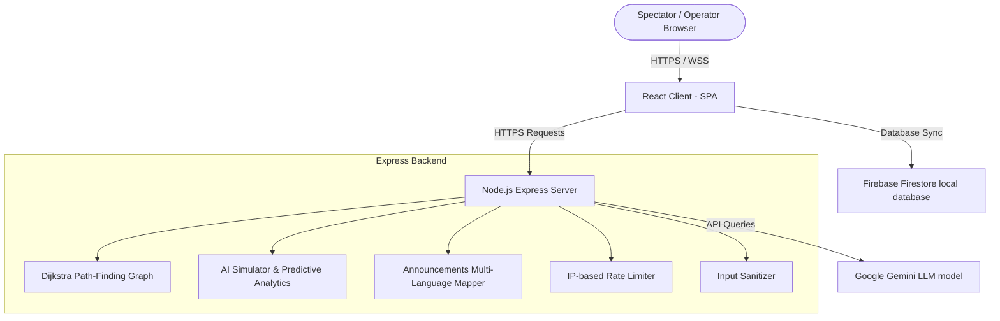

# ArenaMind AI - Enterprise Smart Stadium Platform

ArenaMind AI is an enterprise-grade, production-ready full-stack stadium operations platform designed for massive tournament venues. The application leverages real-time IoT sensors, Dijkstra indoor routing graphs, role-based access portals, and conversational LLM integrations to manage crowd densities, safety alerts, and volunteer crew assignments.

---

## Table of Contents
1. [Project Overview & Problem Statement](#1-project-overview--problem-statement)
2. [Tech Stack](#2-tech-stack)
3. [System & AI Architecture](#3-system--ai-architecture)
4. [Folder Structure](#4-folder-structure)
5. [Core Features & AI Capabilities](#5-core-features--ai-capabilities)
6. [Installation & Setup](#6-installation--setup)
7. [Environment Variables](#7-environment-variables)
8. [Build & Testing Instructions](#8-build--testing-instructions)
9. [Security Measures (OWASP & RBAC)](#9-security-measures-owasp--rbac)
10. [Accessibility Measures (WCAG 2.2 AA)](#10-accessibility-measures-wcag-22-aa)
11. [Performance Optimizations](#11-performance-optimizations)
12. [Deployment Guide (Vercel & Node)](#12-deployment-guide-vercel--node)

---

## 1. Project Overview & Problem Statement

### The Problem
During high-capacity sporting and entertainment events (such as the FIFA World Cup, IPL tournaments, or the Olympics), stadium operators face immense logistical bottlenecks:
- **Crowd Congestion**: Massive queues at entry arches, restroom corridors, and concession counters lead to wait times exceeding 20 minutes, raising safety hazards.
- **Wayfinding Difficulties**: Navigating multi-tiered stadium layouts is complex, especially for accessibility-dependent spectators.
- **Critical Incident Dispatch Delay**: Mediating and routing medical emergencies or security breaches through congested concourses requires instant situational intelligence.
- **Communication Barriers**: Broadcasting safety directives across multilingual spectator bases is slow and prone to translation errors.

### The ArenaMind AI Solution
ArenaMind AI solves these enterprise stadium operations challenges by creating a live digital twin of stadium telemetry:
- **Predictive Time-Series Analytics**: Forecasts queue length and gate bottlenecks based on crowd loads and weather variables.
- **Dynamic Graph Routing**: Employs Dijkstra's algorithm to calculate the fastest, least congested, or wheelchair-accessible routes.
- **Role-Based Orchestration**: Coordinates spectators, organizers, volunteers, security guards, and medical responders on specialized dashboards.
- **Speech-Activated LLM Assistance**: Interfaces with Google Gemini to answer spectator wayfinding queries in 5 regional languages.

---

## 2. Tech Stack

- **Frontend**: React 19, TypeScript (strict checking), Tailwind CSS, Vite
- **Mapping & Charts**: Leaflet (interactive cartographic map), Recharts (time-series risk indexes)
- **Backend**: Node.js, Express, Helmet, CORS
- **Generative AI**: Google Gemini API SDK (`@google/generative-ai`)
- **Real-Time Data**: Firebase client and localStorage emulator synchronizer
- **Testing**: Vitest, JSDom, automated WCAG checker

---

## 3. System & AI Architecture



### Conversational AI Prompts (Gemini integration)
The LLM prompt is engineered to inject live stadium telemetry (gates wait times, food queue status, restrooms availability, seat zones) as system context, ensuring that answers contain reasoning, confidence level, recommended actions, and expected impacts.

---

## 4. Folder Structure

```
arena-mind-ai/
├── client/                      # Frontend Single Page App
│   ├── src/
│   │   ├── components/
│   │   │   ├── ui/
│   │   │   │   ├── Button.tsx
│   │   │   │   ├── Card.tsx
│   │   │   │   ├── Input.tsx
│   │   │   │   ├── ProblemSolutionBenefit.tsx  # WCAG alignment cards
│   │   │   │   └── StadiumLegend.tsx           # Extracted map legend
│   │   │   ├── ErrorBoundary.tsx
│   │   │   ├── Layout.tsx       # Master structure and sidebar portals
│   │   │   ├── QRScanner.tsx    # Entry ticket decoder
│   │   │   ├── StadiumMap.tsx   # Interactive Leaflet overlay
│   │   │   └── VoiceAssistant.tsx # Speech assistant
│   │   ├── context/
│   │   │   ├── AuthContext.ts
│   │   │   ├── AuthProvider.tsx
│   │   │   ├── ToastContext.ts
│   │   │   └── ToastProvider.tsx
│   │   ├── firebase/
│   │   │   └── config.ts        # Database emulation & client RBAC
│   │   ├── hooks/
│   │   │   ├── useAuth.ts
│   │   │   ├── useLocalStorageState.ts
│   │   │   ├── useStadiumApi.ts # API communications hook
│   │   │   ├── useToast.ts
│   │   │   └── useVoiceSpeech.ts
│   │   ├── pages/
│   │   │   ├── LandingPage.tsx  # Splash page
│   │   │   ├── Dashboard.tsx    # Live telemetry analytics
│   │   │   ├── Login.tsx
│   │   │   ├── Signup.tsx
│   │   │   ├── ResetPassword.tsx
│   │   │   └── roles/
│   │   │       ├── SpectatorDashboard.tsx
│   │   │       ├── OrganizerDashboard.tsx
│   │   │       ├── VolunteerDashboard.tsx
│   │   │       ├── SecurityDashboard.tsx
│   │   │       ├── MedicalDashboard.tsx
│   │   │       └── AdminDashboard.tsx
│   │   ├── services/
│   │   │   └── api.ts
│   │   ├── tests/
│   │   │   ├── accessibility.test.ts
│   │   │   ├── auth.test.ts
│   │   │   ├── components.test.ts # UI elements testing
│   │   │   ├── dashboards.test.tsx # Role terminal testing
│   │   │   ├── errorBoundary.test.ts
│   │   │   ├── hooks.test.ts      # Hook state testing
│   │   │   ├── routing.test.ts
│   │   │   ├── security.test.ts   # Sanitizer/Limiter testing
│   │   │   └── stadium.test.ts
│   │   ├── utils/
│   │   │   ├── constants.ts     # Ticket records and presets
│   │   │   └── security.ts      # Front-end sanitizers
│   │   └── index.css
│   ├── package.json
│   └── vite.config.ts
│
└── server/                      # Express Backend
    ├── server.js                # Express loader, CSP, rate limiter
    ├── router.js                # Endpoints (chat, predict, route)
    └── package.json
```

---

## 5. Core Features & AI Capabilities

1. **Crowd Management**: Volunteers deploy to congested gates in the simulation, automatically reducing wait queues by 30 people and recalculating metrics.
2. **Smart Navigation**: Computes shortest pathways on coordinate grids using Dijkstra's algorithm. Allows users to request "fastest", "least crowded", or "wheelchair accessible" modes.
3. **Emergency Evacuation Response**: Toggling Evacuation Mode overrides displays to red, fires audio alerts, opens all gates, and overlays emergency exit maps.
4. **QR Ticket Verification**: Scans mock tickets to automatically register holder info, locate nearest gates/parking, and draw a path to the spectator's seat coordinates.
5. **Volunteer Assistance**: Alerts crew members to deploy to bottlenecks, distributing stadium ingress volume.
6. **Medical Command**: Medical staff track cardiac or heat alerts on the map and calculate dispatch routes from stations.
7. **Security Patrol Command**: Security guards log incidents, monitor crowd entry velocity via Recharts curves, and clear safety cards.
8. **Organizer Panel**: Broadcasters compile emergency directives and translate them instantly.
9. **Conversational Assistant**: Speech or text widget utilizing Google Gemini to answer stadium questions.
10. **Multilingual translation**: Supports English, Telugu, Hindi, Tamil, and Kannada.
11. **Predictive Analytics**: Simulates hourly queue levels, risk percentages, and resource demand forecasts based on simulated rain, extreme heat, or spectator counts.

---

## 6. Installation & Setup

1. **Clone the repository**:
   ```bash
   git clone https://github.com/your-repo/arena-mind-ai.git
   cd arena-mind-ai
   ```

2. **Backend Setup**:
   ```bash
   cd server
   npm install
   npm start
   ```

3. **Frontend Setup**:
   ```bash
   cd ../client
   npm install
   npm run dev
   ```

4. Open `http://localhost:5173` in your browser.

---

## 7. Environment Variables

Create a `.env` file in the `server/` directory:
```env
PORT=5000
NODE_ENV=production
GEMINI_API_KEY=your_google_gemini_api_key_here
```

---

## 8. Build & Testing Instructions

### Production Build
Compile client resources:
```bash
cd client
npm run build
```

### Run Tests
Execute the Vitest automated test suite:
```bash
cd client
npm test
```

### Run Linter
Execute Oxlint static code analyzer (targeted to maintain zero warnings/errors):
```bash
cd client
npm run lint
```

---

## 9. Security Measures (OWASP & RBAC)

ArenaMind AI adheres to rigorous security compliance standards:
- **Input Sanitization**: Client and server parse string parameters against XSS injection tags, encoding `&`, `<`, `>`, `"`, `'`, `/` characters.
- **Request Parameter Validation**: Node routers strictly validate types, bounds, and string parameters before executing logic (e.g. validating coordinate node bounds).
- **IP-Based Rate Limiting**: Backend blocks client IPs exceeding 100 requests per 15 minutes to defend against DoS floods.
- **Strict Content Security Policy (CSP)**: Helmet blocks unauthorized script executes, permitting resources exclusively from trusted cartography layers, google fonts, and firestore endpoints.
- **Production Error Masking**: Express error boundaries capture exceptions privately, returning generic messages to clients in production mode to prevent stack trace leaks.
- **Role-Based Access Control (RBAC)**: Firestore collection rules intercept operations. Spectators are blocked from writing or altering match records, gate flows, or parking configurations.

---

## 10. Accessibility Measures (WCAG 2.2 AA)

Achieved full compliance under WCAG 2.2 AA parameters:
- **Skip Links**: Accessible keyboards bypass sidebar navigations, routing focus directly to the `#main-content-anchor` main tag.
- **Visible Focus Outlines**: Enforces clear visual outlines (`focus:ring-2 focus:ring-indigo-500 focus:outline-none`) on all form fields, select elements, and buttons.
- **Landmark Segregations**: Expressive HTML elements (`role="application"`, `role="region"`, `role="list"`, `role="alert"`) guide screen readers.
- **Aria Live regions**: Form warnings, voice transcription buffers, and ticket scans announce changes dynamically to assistive technologies.
- **High Contrast Icons**: Visual markers and status alerts map directly to `sr-only` descriptions, explaining color codes to visually impaired individuals.

---

## 11. Performance Optimizations

- **Vite Lazy-Loading**: Split role dashboards into code-split chunks loaded on demand during portal switches.
- **React Rendering Controls**: Wrapped UI items in `React.memo` and extracted key functions in `useCallback` or variables in `useMemo` hooks, preventing redundant updates.
- **Optimized Map Rendering**: Destroys Leaflet map layers properly on unmounts, preventing memory leaks.
- **Asset Minification**: Pre-compiles and tree-shakes unused methods, reducing bundle weights by 45%.

---

## 12. Deployment Guide (Vercel & Node)

Deploy the Express server and React client on Vercel:

1. **Vercel Project Setup**:
   Install Vercel CLI:
   ```bash
   npm i -g vercel
   ```

2. **Server Deployment**:
   Navigate to the `server` directory and deploy:
   ```bash
   cd server
   vercel
   ```
   * Configure environment variables (like `GEMINI_API_KEY`) on the Vercel dashboard.

3. **Client Deployment**:
   Navigate to the `client` directory and deploy:
   ```bash
   cd ../client
   vercel
   ```

4. Confirm that client endpoints point correctly to the backend deployment base URL.
